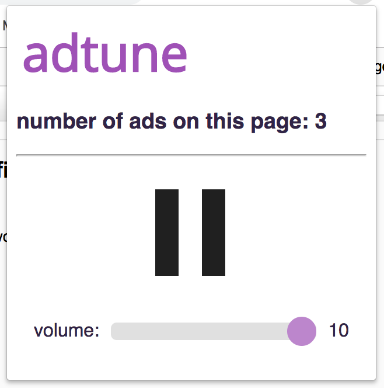

# Adtune - a computer music-mediated reminder of just how many ads are out there

<!-- pitch -->

Adtune consists of a client chrome extension and a server written in Python/Flask.

A TreeHacks 2019 project.

## Requirements

-   jQuery
-   Google Chrome
-   Python 2.7
-   ChucK

See subdirectory READMEs for setup instructions.

## ChucK

[ChucK](http://chuck.cs.princeton.edu/) is a computer music programming language developed by Ge Wang and Perry Cook. It presents a unique time-based, concurrent programming model for precise control of elapsed time and has many tools for sound synthesis. ChucK users include researchers and computer music composers and performers. Installation details can be found at its homepage, including its IDE, MiniAudicle.

## How it works

We use server-side text-matching with known ad hosts as provided
by [easylist](https://easylist.to/) to count the number of ads on a webpage.  

Based on this count, the server executes `ChucK` to create a `.wav` that
can be served as a static resource.  

The chrome extension creates a Javascript `Audio` object and injects it
into the webpage.  The file starts playing once the user interacts
with the webpage.  This is a constraint set by Chrome's autoplay
policies (TODO link).

The popup window of the chrome extension provides play/pause and volume control for this track.

## Examples

[Audio file](https://drive.google.com/open?id=1dxAQ8idoHkLYgKIa6Qf5fTVEQtEBySUC)

[Audio file](https://drive.google.com/open?id=1NLQhRHbhmR-YNxb4pCTq2BKA5S9v4qqQ)

[Audio file](https://drive.google.com/open?id=1rG3sXzjEf0jMUc9PV8wvsnVcQnZf-0XK)

## Challenges

### Counting ads

We wanted Adtune to work regardless of whether the user had an Ad Blocker installed.  As a result, we chose to count ads on the server side.  If the user had an Ad Blocker installed, we would not have been able to detect removed ads from the chrome extension.   

Our method for identifying ads is rudimentary compared to industry Ad Blockers.  Our extension shows the number of ads we detect.  At times, this number varies greatly from other installed Ad Blockers.

### Creating audio files

It's a bit slow.  

### Controlling the audio track

We wanted the music to play regardless of whether our extension was opened.  Therefore, we had to inject the audio track into the webpage.  This caused different challenges in our ability to keep the extension popup's application state in sync with the injected content.

### Cross-Domain HTTP/HTTPS Requests

For now, the server runs on HTTP.  Sometimes, websites don't allow mixed-content requests (using HTTP from an HTTPS webpage).  

Some websites also don't allow web-crawling.  We use `urllib2` and `BeautifulSoup` on the server to get all the links on a webpage, and for these websites, this fails.
